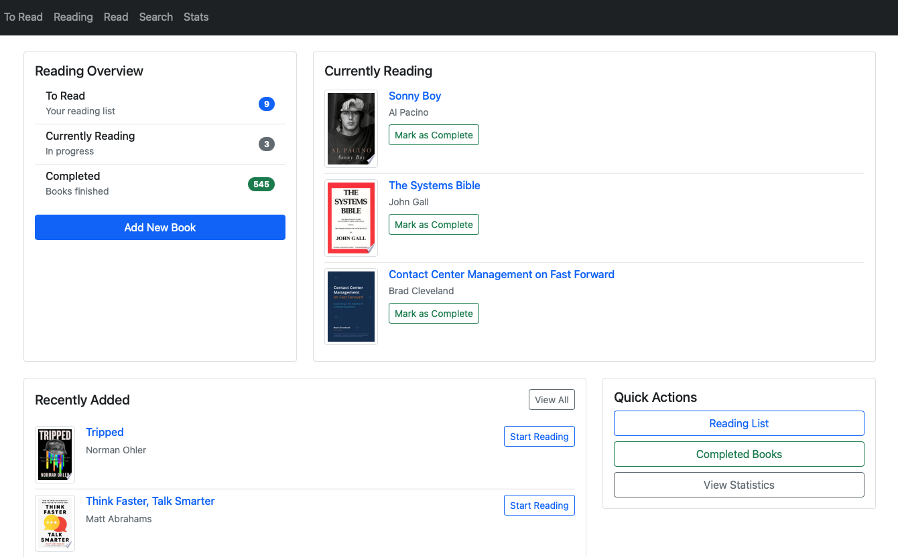
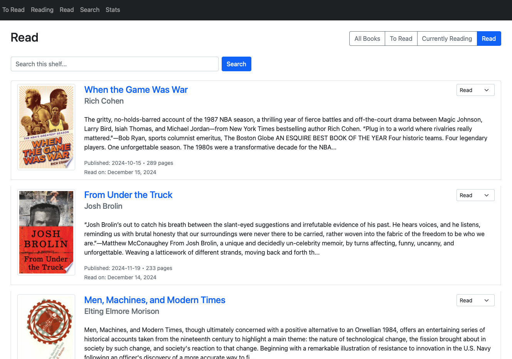
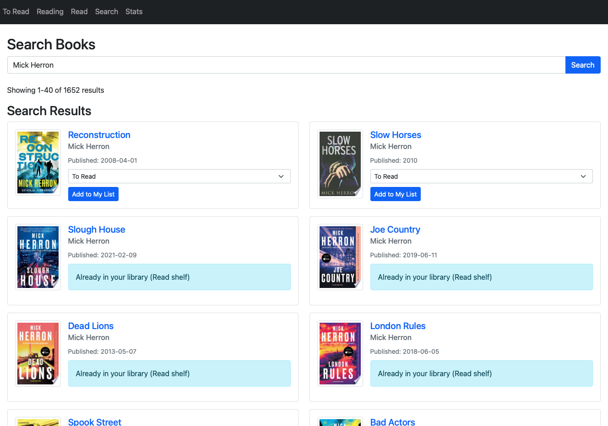
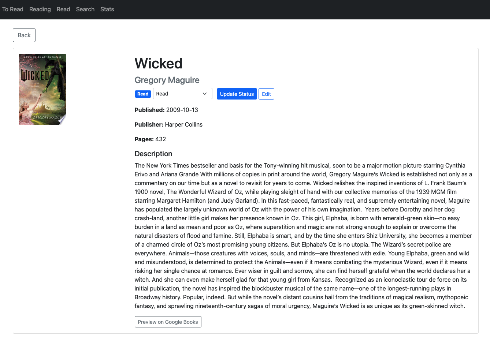

# User Guide

## Getting Started

### Account Creation and Setup

1. **Creating an Account**
   - Visit the signup page
   - Enter your username, email, and password
   - Verify your email address
   - Complete your profile setup

2. **Logging In**
   - Use your username/email and password
   - Enable "Remember Me" for convenience
   - Reset password if forgotten
   - Secure session management

### Interface Overview

1. **Main Interface**
   
   - A: Navigation menu
   - B: Search bar
   - C: Shelf quick access
   - D: Recent activity
   - E: Statistics overview

2. **Book Management**
   
   - A: Add book button
   - B: Shelf filters
   - C: Sort options
   - D: Book cards
   - E: Status controls

3. **Search Interface**
   
   - A: Search input
   - B: Filter options
   - C: Results grid
   - D: Preview panel

4. **Book Details**
   
   - A: Cover image
   - B: Metadata
   - C: Description
   - D: Action buttons
   - E: Reading status

### Basic Navigation

1. **Main Dashboard**
   - Overview of your library
   - Quick access to shelves
   - Recent activity
   - Reading statistics

2. **Menu Structure**
   - Library (Shelves)
   - Search Books
   - Profile
   - Statistics
   - Settings

## Managing Your Library

### Adding Books

1. **Search and Add**
   - Use the search bar
   - Filter by title, author, ISBN
   - Preview book details
   - Select shelf (To Read, Reading, Read)

2. **Manual Entry**
   - Add custom book entries
   - Required fields: Title, Author
   - Optional metadata
   - Upload cover images

### Organizing Books

1. **Shelves**
   - To Read: Books you plan to read
   - Currently Reading: Active books
   - Read: Completed books
   - Custom shelves (coming soon)

2. **Moving Books**
   - Change book status
   - Update reading progress
   - Mark as complete
   - Remove from library

### Book Details

1. **Viewing Details**
   - Cover image
   - Publication information
   - Description
   - Categories
   - Reading status

2. **Editing Books**
   - Update metadata
   - Refresh from Google Books
   - Add personal notes
   - Set reading dates

## Search and Discovery

### Search Features

1. **Basic Search**
   - Search by title
   - Search by author
   - Search by ISBN
   - Full-text search

2. **Advanced Search**
   - Category filters
   - Publication date range
   - Language options
   - Format filters

### Discovery Tools

1. **Browse Categories**
   - Genre exploration
   - Subject categories
   - Popular books
   - New releases

2. **Recommendations**
   - Based on reading history
   - Similar books
   - Author collections
   - Category matches

## Reading Progress

### Tracking Progress

1. **Status Updates**
   - Mark books as started
   - Update reading progress
   - Set completion date
   - Add reading notes

2. **Reading History**
   - View completed books
   - Track reading dates
   - Reading streaks
   - Annual goals

### Statistics

1. **Reading Stats**
   - Books read
   - Pages completed
   - Reading pace
   - Genre distribution

2. **Analytics**
   - Monthly progress
   - Category breakdown
   - Author diversity
   - Reading trends

## Profile Management

### User Settings

1. **Account Settings**
   - Update email
   - Change password
   - Profile information
   - Privacy settings

2. **Preferences**
   - Display options
   - Email notifications
   - Language preferences
   - Theme settings

### Data Management

1. **Export Options**
   - Export to CSV
   - Export to JSON
   - Database backups (automated daily)
   - Print reports

2. **Backup Features**
   - Automatic daily backups
   - Compressed backup files
   - 7-day retention policy
   - Safety backups during restore

3. **Privacy Controls**
   - Public profile options
   - Reading privacy
   - Data sharing
   - Account deletion

## Advanced Features

### Google Books Integration

1. **Book Search**
   - Access millions of books
   - Rich metadata
   - Cover images
   - Publication details

2. **Metadata Updates**
   - Refresh book data
   - Update covers
   - Sync descriptions
   - Add missing info

### Library Management

1. **Bulk Operations**
   - Import books
   - Batch updates
   - Mass categorization
   - Shelf organization

2. **Custom Fields**
   - Personal ratings
   - Notes and reviews
   - Reading locations
   - Custom tags

## Tips and Best Practices

### Organizing Your Library

1. **Effective Organization**
   - Consistent categorization
   - Regular updates
   - Clear naming
   - Proper metadata

2. **Maintenance Tips**
   - Regular cleanup
   - Update statuses
   - Verify metadata
   - Backup data

### Reading Workflow

1. **Efficient Reading**
   - Track progress regularly
   - Update status promptly
   - Add completion dates
   - Maintain notes

2. **Goal Setting**
   - Set realistic goals
   - Track progress
   - Adjust targets
   - Celebrate achievements

## Troubleshooting

### Common Issues

1. **Search Problems**
   - Check spelling
   - Try alternative terms
   - Use ISBN if available
   - Clear filters

2. **Book Updates**
   - Verify connection
   - Check API status
   - Retry operation
   - Manual update

### Getting Help

1. **Support Resources**
   - FAQ section
   - Help documentation
   - Community forum
   - Contact support

2. **Feedback**
   - Report issues
   - Suggest features
   - Share feedback
   - Rate experience

## FAQ

### Account Management

Q: How do I reset my password?
A: Click "Forgot Password" on the login page, enter your email, and follow the reset instructions.

Q: Can I change my username?
A: Username changes are not currently supported for data consistency.

### Book Management

Q: How do I add books not found in Google Books?
A: Use the manual entry option in the "Add Book" form.

Q: Can I merge duplicate books?
A: Contact support for assistance with merging duplicate entries.

### Data and Privacy

Q: Is my reading data private?
A: Yes, your reading data is private by default and visible only to you.

Q: How can I export my data?
A: Use the export options in Profile Settings to download CSV or JSON formats.

## Updates and Changes

### Recent Updates

1. **New Features**
   - Password reset system
   - Full-text search
   - Reading statistics
   - Book cover display

2. **Improvements**
   - Search performance
   - UI enhancements
   - Mobile responsiveness
   - Error handling

### Coming Soon

1. **Planned Features**
   - Custom shelves
   - Reading challenges
   - Social features
   - Mobile app

2. **Enhancements**
   - Advanced statistics
   - Improved search
   - Better recommendations
   - More export options

## Further Reading

- [API Documentation](api/README.md)
- [Security Guide](deployment/security.md)
- [Development Setup](development/setup.md)
- [Contributing Guidelines](CONTRIBUTING.md) 